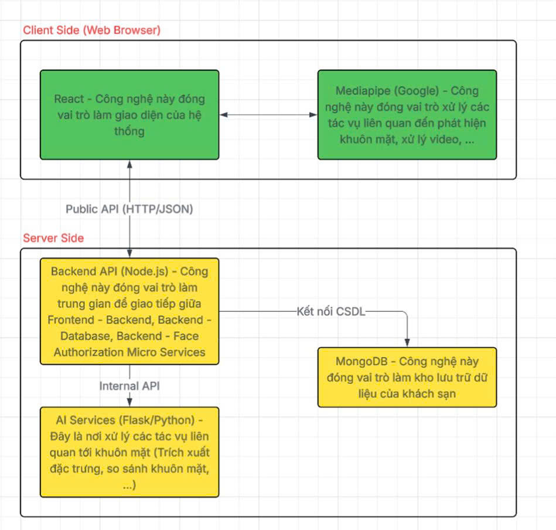
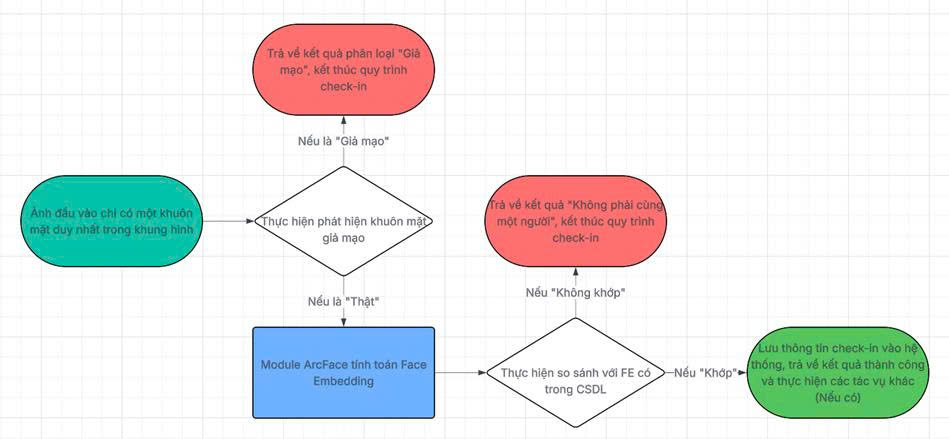

# Automated Hotel Check-in System with Face Authentication and Anti-spoofing


---

## 📌 Project Overview

The system provides an end-to-end solution from online room booking and room management to automated self-service check-in using facial recognition. The core of the system is real-time dual-layer biometric authentication:
1. **Liveness Detection (Anti-spoofing):** Utilizes a custom-trained **ResNet-18** Deep Learning model to detect presentation attacks (spoofing attempts) such as printed photos, replay attacks via screens (mobiles/tablets), or masks.
2. **Face Matching (Recognition):** Utilizes the state-of-the-art **InsightFace (buffalo_l model)** to extract highly accurate face embeddings and verify them against the face profile registered during booking.

### Key Features:
* **Guest Portal (Client facing):**
  * Search, view details, and book hotel rooms online.
  * Register guest details and capture a portrait photo (extract and save high-quality face embeddings as a biometric key).
  * Self-service contactless check-in at hotel Kiosks using real-time camera feeds to generate a digital room key.
* **Admin Dashboard (Employee/Management facing):**
  * Manage rooms, room availability, and live status (Available, Booked, Occupied).
  * Oversee booking transactions, check-in logs, and room keys.
  * System configurations, user role authorization, and logs.

---

## 💻 Installation & Setup

### 📋 Prerequisites
* **Node.js** (Recommended: v18 or higher)
* **Python** (Recommended: 3.9 - 3.11)
* **MongoDB** (The project currently connects directly to a MongoDB Atlas cluster; ensure your machine is connected to the Internet).

---

### Step 1: Clone the Repository
Open your terminal and clone the project:
```bash
git clone https://github.com/chauquocvinh2234/Automated_Hotel_Check-in_System_with_Face_Authentication_and_Anti-spoofing.git
cd Automated_Hotel_Check-in_System_with_Face_Authentication_and_Anti-spoofing
```

---

### Step 2: Set up the Python AI Authentication Microservice
This microservice processes heavy AI tasks like liveness detection and face embedding extraction.

1. **Navigate to the microservice directory:**
   ```bash
   cd FinalProject_CV/FaceAuthorizationSystem/FaceAuthorization_MicroService
   ```

2. **Create and activate a virtual environment (Recommended):**
   ```bash
   python -m venv venv
   # On Windows (PowerShell)
   .\venv\Scripts\Activate.ps1
   # On macOS/Linux
   source venv/bin/activate
   ```

3. **Install dependencies:**
   ```bash
   pip install -r requirements.txt
   ```

4. **Launch the Flask Server:**
   ```bash
   python BackendServer.py
   ```
---

### Step 3: Set up the Node.js Backend Server
This backend orchestrates the main hotel business logic and communicates with the MongoDB database.

1. **Open a new terminal window and navigate to the backend folder:**
   ```bash
   cd FinalProject_CV/FaceAuthorizationSystem/backend
   ```

2. **Install Node modules:**
   ```bash
   npm install
   ```

3. **Configure environment variables (`.env`):**
   Create a `.env` file in the backend root directory (next to `app.js`) and define the JWT secret key:
   ```env
   JWT_KEY=THI_GIAC_MAY_TINH_SECRET_KEY
   ```

4. **Launch the Backend Server:**
   ```bash
   npm start
   ```
   *The main backend server will start on `http://localhost:3000` and automatically connect to the MongoDB Atlas cluster.*

---

### Step 4: Set up the React Frontend (Vite)
This is the interactive client-side user interface.

1. **Open a new terminal window and navigate to the frontend folder:**
   ```bash
   cd FinalProject_CV/FaceAuthorizationSystem/frontend
   ```

2. **Install frontend dependencies:**
   ```bash
   npm install
   ```

3. **Launch the development server:**
   ```bash
   npm run dev
   ```
   *Open your browser and navigate to `http://localhost:5173` to explore the system!*

## ⚙️ System Architecture & Workflow

The system is engineered following a **Microservices Architecture** to guarantee clean isolation between standard business logic and compute-heavy AI tasks. 

### 1. High-Level Architecture Diagram


### 2. Funnel-based AI Processing Pipeline
To optimize processing speed, the system integrates **Google MediaPipe** on the client side to track and crop faces directly in the browser (~22 FPS). Once sent to the server, the image passes through a sequential funnel pipeline:


* **Step 1:** The FAS module validates if the face is live. If a spoof attack is detected (threshold score > 0.620), the pipeline terminates immediately with a `403 Forbidden` status to conserve server computing power.
* **Step 2:** Only verified "Real" faces are passed to the ArcFace module to extract the 512-D embedding and run a Cosine Similarity match against the registration templates stored in MongoDB.

---

---

## 🛠️ Technology Stack
* **Frontend Kiosk:** React, Google MediaPipe Face Detection
* **Core Business Backend:** Node.js, Express REST API
* **AI Inference Server:** Python, Flask API, PyTorch, OpenCV
* **Database Engine:** MongoDB (storing user metadata and 512-D vector embeddings)

---

## 📈 Experimental Results & Performance

### 1. Model Accuracy Evaluation
* **Face Anti-Spoofing (FAS):** Achieved a top **Test Accuracy of 99.77%** after multi-stage transfer learning and fine-tuning on the evaluation dataset.
* **ArcFace Verification:** Minimizes intra-class variance while maximizing inter-class margins, completely eliminating the feature-space overlap visible in standard Softmax baselines.

#### A. LFW Benchmark Performance
The 2x2 comparison matrix below visualizes the cosine similarity distributions and the 2D t-SNE dimensional reductions for both loss functions on the standard LFW dataset:

| Evaluation Metric | Baseline (Softmax Loss) | Proposed (ArcFace Loss) |
| :---: | :---: | :---: |
| **Similarity Histogram** |  |  |
| **t-SNE Clustering** |  |  |

#### B. Celebrity Face Images (Kaggle Dataset) Performance
The evaluation matrix below demonstrates the model robustness and domain generalization capabilities on the independent Celebrity Face Images dataset:

| Evaluation Metric | Baseline (Softmax Loss) | Proposed (ArcFace Loss) |
| :---: | :---: | :---: |
| **Similarity Histogram** |  |  |
| **t-SNE Clustering** |  |  |

### 2. System Latency Metrics (Processing Speed)
The table below details the execution time benchmarks measured end-to-end on our local server deployment environment:

| Step / Module | Underlying Technology | Enrollment Scenario <br> (High-Res Image Upload) | Check-in Scenario <br> (Real-Time Webcam) | Operational Notes |
| :--- | :---: | :---: | :---: | :--- |
| **Frontend Tracking** | MediaPipe | N/A | 45.63 ms | Runs client-side directly inside the browser |
| **Image Decoding** | OpenCV | 35.34 ms | 8.67 ms | Registration images are ~4x larger in file size |
| **Feature Extraction** | InsightFace (ArcFace) | 694.37 ms | 237.00 ms | Enrollment prioritizes depth; Check-in prioritizes speed |
| **Liveness Check** | ResNet-18 | 125.15 ms | 37.52 ms | Larger crop windows demand slightly higher processing |
| **Total Backend Latency** | Python/Flask | **858.88 ms** | **284.49 ms** | Check-in pipeline runs roughly **3x faster** than registration |
| **Total End-to-End Latency** | System-wide | **~0.90 seconds** | **~0.33 seconds** | Delivers an "instant-feedback" zero-latency user experience |

---
## 📂 Folder Structure

```text
Hotel_Check-in_System/
├── FOLDER_STRUCTURE.md                             # Project folder structure description (this file)
├── .gitignore                                      # Root Git ignore rules
├── 422001503101_Nhom2_UngDungXacThucKhuonMat...pdf # Project documentation report (PDF)
├── 422001503101_Nhom2_UngDungXacThucKhuonMat...pptx# Project presentation slide (PPTX)
└── FinalProject_CV/                                # Main Computer Vision & Web Application folder
    ├── FaceAntiSpoofing/                           # Jupyter Notebook for Face Anti-Spoofing Model training
    │   └── FAS_Model.ipynb                         # Model development, EDA and training pipeline
    └── FaceAuthorizationSystem/                    # Face Authorization Web Application
        ├── .gitattributes                          # Git attributes for LFS / line endings
        ├── .gitignore                              # Main application gitignore
        ├── FaceAuthorization_MicroService/         # Python Flask/FastAPI Microservice for AI Face Authentication
        │   ├── BackendServer.py                    # Python Server routing for Face Anti-Spoofing & Verification
        │   ├── Face_Anti_Spoofing_Model_...pth    # Trained PyTorch Model weights (.pth)
        │   └── requirements.txt                    # Python dependencies
        ├── backend/                                # Node.js Express Backend
        │   ├── app.js                              # Main server entrypoint
        │   ├── hash.js                             # Hashing utility for passwords/keys
        │   ├── package.json                        # Node dependencies and scripts
        │   ├── controllers/                        # Controller logic (handles requests)
        │   │   ├── auths-controllers.js            # User/Guest face & password auth
        │   │   ├── booking-controllers.js          # Room booking handling
        │   │   ├── management-controllers.js       # Employee & hotel system management
        │   │   └── rooms-controllers.js            # Room status management
        │   ├── middleware/                         # Custom express middleware (auth, cors, file-upload)
        │   ├── models/                             # Mongoose Database Models (MongoDB schemas)
        │   │   ├── Booking.js                      # Booking Schema
        │   │   ├── Employee.js                     # Employee Schema
        │   │   ├── Guest.js                        # Guest / Customer Schema
        │   │   ├── Room.js                         # Room Schema
        │   │   ├── RoomKey.js                      # Generated Digital Room Keys
        │   │   └── http-error.js                   # Custom HTTP Error handler model
        │   ├── routes/                             # API Routes definition
        │   │   ├── auths-routes.js
        │   │   ├── booking-routes.js
        │   │   ├── management-routes.js
        │   │   └── rooms-routes.js
        │   └── validators/                         # Input request validators
        └── frontend/                               # React + Vite Frontend
            ├── index.html                          # Entry HTML
            ├── vite.config.js                      # Vite bundle configuration
            ├── package.json                        # Frontend packages and scripts
            ├── public/                             # Public static assets
            └── src/                                # React application source code
                ├── main.jsx                        # React app entry point
                ├── App.jsx                         # Main app router & component tree
                ├── index.css                       # Global styles
                ├── assets/                         # UI images and icons
                ├── components/                     # Reusable UI React Components
                ├── data/                           # Mock data or constant values
                ├── pages/                          # Page components (Login, Booking, Admin Dashboard)
                └── util/                           # Utility and helper functions
```

### Component Summaries

#### 1. `FaceAntiSpoofing`
* **Technology**: Python, PyTorch, Jupyter Notebook.
* **Role**: Model research and development. It contains the logic to train the deep learning model capable of distinguishing between real human faces and spoofing attempts (e.g., photos, videos, masks).

#### 2. `FaceAuthorization_MicroService`
* **Technology**: Python, Flask, PyTorch.
* **Role**: A lightweight microservice that loads the trained PyTorch anti-spoofing model (`.pth`) and serves an API endpoint. When the main backend receives a check-in image, it queries this microservice to verify face authenticity before checking the user in.

#### 3. `backend`
* **Technology**: Node.js, Express, MongoDB/Mongoose.
* **Role**: The main application server. It orchestrates user registration, booking flow, room key generation, and coordinates authentication checks with the Face Authorization Microservice.

#### 4. `frontend`
* **Technology**: React, Vite, CSS.
* **Role**: The interactive client-side user interface. Provides dashboards for guests to check in using their camera, and administration screens for hotel employees to monitor room occupancy and booking logs.

---
## 🤝 Contributors
- Châu Quốc Vinh
  + [Github](https://github.com/chauquocvinh2234)
  + [Gmail](vinhit220304@gmail.com)
- Vũ Trọng Nghĩa
  + [Github](https://github.com/TrongNghia041104)
  + [Gmail](nghia.hpotaku04@gmail.com)
- Trần Đặng Thiên Phúc
